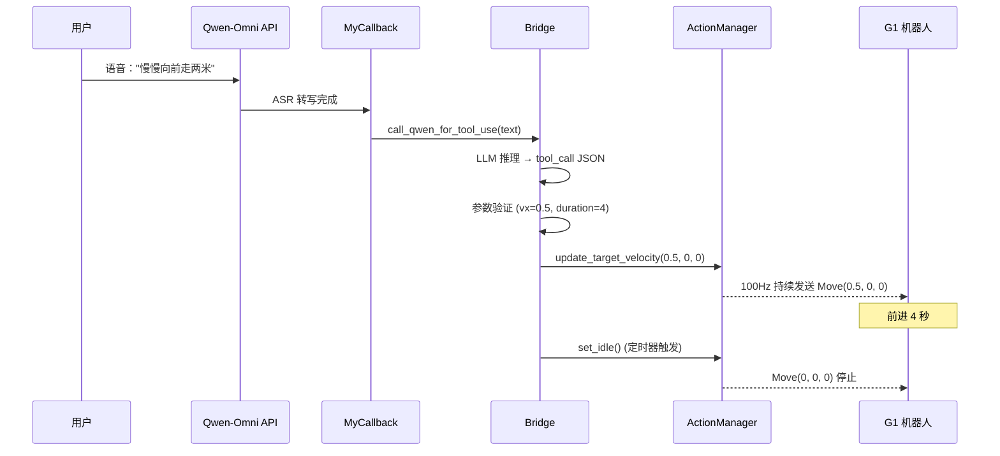

# Unitree G1 具身智能控制系统

## 项目信息

| 项目     | 内容                              |
| :------- | :-------------------------------- |
| 项目名   | Unitree G1 Embodied AI Controller |
| 负责人   | bozhi                             |
| 创建时间 | 2026-1-20                         |
| 状态     | 进行中（实机验证阶段）            |

---

## 项目概述

基于多模态大模型的宇树 G1 机器人具身智能控制系统，实现"大脑"与"小脑"协同的控制架构：
- **大脑（Brain）**：多模态大模型（Qwen-Omni）负责环境感知、意图理解与决策生成
- **小脑（Cerebellum）**：Unitree SDK2 负责底层运动控制的精确执行
- **闭环控制**：从感知输入 → 决策推理 → 动作执行的完整控制链路

---

## 核心架构

### 三层控制架构

```
┌──────────────────────────────────────────────────┐
│              大脑层 (Brain Layer)                 │
│   LLM/VLM - 环境感知 + 意图理解 + 决策生成       │
└───────────────────┬──────────────────────────────┘
                    │ JSON 格式指令
                    ▼
┌──────────────────────────────────────────────────┐
│             转换层 (Bridge Layer)                 │
│   JSON 解析 + 参数验证 + 安全检查                │
└───────────────────┬──────────────────────────────┘
                    │ Python 函数调用
                    ▼
┌──────────────────────────────────────────────────┐
│           小脑层 (Cerebellum Layer)               │
│   ActionManager (100Hz 心跳) + Unitree SDK2      │
└──────────────────────────────────────────────────┘
```

### 模块结构

```
VoiceInteraction/                          # 核心交互层
├── multimodal_interaction.py             # 主程序：多模态实时交互
├── action_manager.py                     # 守护线程：100Hz 心跳维持 + 任务队列执行器
├── aec_processor.py                      # 音频回声消除处理器
├── bridge.py                             # JSON 解析 + 动作映射 + 多工具顺序执行
├── tool_schema.py                        # Function Calling 工具定义
├── config.py                             # 安全参数配置（含 AEC_CONFIG）
├── emergency_stop.py                     # 物理急停监听
└── llm_api_config.py                     # API 配置管理

unitree_sdk2py/g1/loco/
└── g1_loco_client.py                     # G1 专用运动控制客户端（LocoClient，而非SportClient）
```

---

## 进度追踪

### ✅ 已完成

**阶段1：控制频率解耦**（2026-01-20）
- [x] `ActionManager` 守护线程实现（100Hz 高频心跳维持）
- [x] 集成到主程序，解决 LLM 推理延迟导致的心跳超时问题
- [x] 异步状态更新机制

**阶段2：Function Calling 集成**（2026-01-21）
- [x] 工具定义（`tool_schema.py`）：`move_robot`, `stop_robot`, `rotate_angle`, `emergency_stop`
- [x] 桥接层（`bridge.py`）：参数验证、工具分发、错误处理
- [x] 混合方案：关键词快速响应 + LLM 工具调用
- [x] 完整单元测试（59个测试用例，100%通过）

**阶段3：安全与急停机制**（2026-01-21）
- [x] 键盘急停监听（Space 键触发）
- [x] SDK 扩展：`GetFsmId()` / `RecoveryStand()` 状态管理
- [x] 参数范围验证与截断
- [x] 双重保险机制（软件急停 + SDK 阻尼模式）

**阶段4：全双工与打断优化**（2026-01-22）
- [x] 全双工对话：播放期间保持麦克风采集与 ASR 转写
- [x] 软件打断机制：ASR 识别打断指令（"停止播放"、"闭嘴"等）自动中止播放
- [x] 播放器低延迟优化：sub-chunking（40ms 粒度）实现快速响应
- [x] 安全加固：打断指令同步检测运动停止意图（"停"、"急停"）并触发 ActionManager 停止

**阶段5：音频回声消除（AEC）**（2026-01-22）
- [x] 创建 `aec_processor.py` 模块封装 speexdsp 回声消除功能
- [x] 修改 `B64PCMPlayer` 添加参考信号缓冲区（24kHz → 16kHz 重采样）
- [x] 主循环集成 AEC 分帧处理（20ms/帧，320 samples）
- [x] 配置管理：添加 `AEC_CONFIG` 配置项
- [x] 单元测试：创建 `test_aec.py` 测试文件
- [x] **解决全双工自激问题**：机器人播放时不会被自己的声音控制

**阶段6：任务队列与复杂指令解析**（2026-01-22）
- [x] 创建 `TaskStatus` 枚举和 `RobotTask` 数据类
- [x] ActionManager 添加任务队列（deque）和任务执行器线程
- [x] 实现任务管理方法：`add_task()`, `clear_task_queue()`, `get_task_status()`
- [x] 实现任务执行器循环：`_task_executor_loop()` 独立线程
- [x] 修改 Bridge 层：`execute_tool_calls_sequential()` 支持多工具调用
- [x] 修改 `_execute_move_robot()` 和 `_execute_rotate_angle()` 使用任务队列
- [x] **解决复杂指令解析问题**：支持"前进一米并且右转90度"等多步骤指令

**阶段7：连接保活机制优化**（2026-01-28）
- [x] 移除 `on_close` 中的强制退出逻辑（`os._exit(0)`）
- [x] 添加连接状态标志 `_connection_alive` 实现优雅退出
- [x] 调整 VAD 配置：静音超时从默认 2-3 秒延长到 10 分钟（600,000 ms）
- [x] 主循环添加连接状态检查，防止断连后继续运行
- [x] **解决长时间静音自动退出问题**：支持 10 分钟无语音交互不断连

### 📋 待完成

**实机验证阶段**（当前）
- [ ] 验证 ActionManager 长时间稳定性
- [ ] 验证 Function Calling 复杂指令执行
- [ ] 验证急停与自动恢复流程

**后续优化**

**待解决的核心问题**（实机测试发现）
- [x] ~~**全双工自激问题**~~：已通过 AEC（音频回声消除）技术解决
- [x] ~~**复杂指令解析不完整**~~：已通过任务队列机制解决，现支持多步骤顺序执行

**功能改进**
- [ ] 状态监测与自动恢复机制
- [ ] 环境感知增强（视觉 SLAM）
- [ ] 多轮对话上下文管理

---

## 关键技术决策

### 1. 控制频率解耦

**问题**：大模型推理耗时（秒级）导致 SDK 心跳超时，触发 Watchdog 锁死

**方案**：`ActionManager` 守护线程
- 以 100Hz 高频维持 SDK 心跳
- 大模型异步修改目标状态变量，不阻塞控制循环
- 使用绝对时间锚点消除累积误差

**效果**：LLM 推理 5 秒时，SDK 心跳仍然稳定

### 2. Function Calling 工具调用

**问题**：关键词匹配泛化能力弱，无法理解复杂自然语言指令

**方案**：混合架构
- **快速路径**：关键词匹配（零延迟）
- **智能路径**：LLM 工具调用（0.5-1秒延迟，支持复杂指令）
- **回退机制**：LLM 失败时自动回退到关键词匹配

**工具定义**（OpenAI 标准格式）：
- `move_robot(vx, vy, vyaw, duration)` - 控制运动
- `rotate_angle(degrees)` - 旋转指定角度
- `stop_robot()` / `emergency_stop()` - 停止 / 急停

### 3. G1 专用接口适配

**问题**：G1 人形机器人使用 `LocoClient`，而其他机型（Go2/B2）使用 `SportClient`

**方案**：专用接口封装
- `LocoClient.Move(vx, vy, vyaw)` - 速度控制（-1.0 ~ 1.0 m/s）
- `LocoClient.Damp()` - 阻尼模式（急停专用，FSM ID=1）
- `LocoClient.Squat2StandUp()` - G1 专用起立指令（从低姿态恢复）
- `LocoClient.GetFsmId()` - 状态查询（返回当前 FSM 状态 ID）

**注意事项**：
- G1 不支持 `SportClient.StandUp()` 等通用接口
- 使用 `RecoveryStand()` 而非 `Start()` 以应对跌倒恢复

### 4. 全双工与打断机制

**问题**：传统半双工对话模式下，机器人播报时无法响应用户打断，体验僵硬

**方案**：全双工 + ASR 驱动的软件打断
- **全双工模式**：播放期间不暂停麦克风，持续发送音频到服务端进行 ASR 转写
- **打断检测**：`is_interrupt_command()` 识别强触发词（"打断"、"闭嘴"、"停止播放"）
- **快速响应**：
  - `B64PCMPlayer.interrupt()` 立即清空播放队列并重置输出流
  - sub-chunking（40ms 粒度 write）减少声卡缓冲延迟
- **安全联动**：打断指令若包含运动停止意图（"停"、"急停"），同步触发 `ActionManager.emergency_stop()`

**效果**：用户可在机器人说话时随时打断，延迟 < 200ms

### 5. 安全机制

**多层保护**：
1. **参数验证**：速度/角度/持续时间范围检查，超限自动截断
2. **物理急停**：Space 键触发 → `ActionManager.emergency_stop()` + `g1.Damp()`
3. **状态监测**：`GetFsmId()` 查询机器人状态，异常时拒绝危险指令
4. **自动恢复**：`RecoveryStand()` 从躺下/摔倒恢复到站立

### 6. 任务队列机制

**问题**：复杂指令（如"前进一米并且右转90度"）只执行后半部分，前半部分被覆盖

**方案**：任务队列 + 独立执行器线程
- **任务队列**：使用 `deque` 存储多个待执行任务（FIFO）
- **任务执行器**：独立线程从队列中取任务并顺序执行
- **数据结构**：`RobotTask` 包含 task_id、task_type、parameters、duration、status 等信息
- **状态管理**：支持 pending、running、completed、failed、cancelled 五种状态
- **安全联动**：急停时自动清空队列，中止所有未执行任务

**关键方法**：
- `add_task(task_type, parameters, duration)` - 添加任务到队列
- `clear_task_queue()` - 清空队列（急停时调用）
- `get_task_status(task_id)` - 查询任务状态
- `_task_executor_loop()` - 任务执行器线程循环

**效果**：LLM 返回多个工具调用时，系统能够顺序执行所有步骤，完整实现复杂指令

### 7. 连接保活机制

**问题**：原实现中 WebSocket 连接在长时间静音后自动断开，导致程序强制退出

**根本原因**：
1. `on_close` 回调中使用 `os._exit(0)` 强制杀死进程
2. 服务端 VAD 默认 2-3 秒静音超时，判定对话结束并关闭连接
3. 主循环缺少连接状态检测机制

**方案**：三重保护机制
- **优雅退出**：移除 `os._exit(0)`，改为设置 `_connection_alive = False` 通知主循环
- **延长超时**：配置 `turn_detection_config` 将 `silence_duration_ms` 设为 600,000（10 分钟）
- **状态检测**：主循环每次迭代检查 `_connection_alive`，断连时记录日志并退出

**关键配置**：
```python
turn_detection_config={
    "silence_duration_ms": 600000,  # 10分钟静音超时
    "prefix_padding_ms": 300,       # 前缓冲300ms
    "threshold": 0.5                # VAD阈值
}
```

**效果**：支持 10 分钟无语音交互不断连，资源正确释放，无进程僵死

---

## 数据流示例

### 用户语音指令 → 机器人执行



---

## 技术栈

- **大模型服务**：Qwen-Omni (通义千问) Realtime API
- **机器人平台**：宇树 G1 人形机器人
- **控制 SDK**：Unitree SDK2 (Python)
- **编程语言**：Python 3.x
- **核心技术**：
  - 多模态大模型（LLM/VLM）
  - Function Calling / Tool Use
  - 实时语音对话（全双工）
  - 高频控制循环（100Hz）
  - 多线程异步架构

**依赖库**：
- `dashscope` - 通义千问 API
- `openai>=1.0.0` - Function Calling 推理
- `pynput>=1.8.0` - 键盘急停监听
- `pyaudio` - 音频采集与播放
- `opencv-python` - 视觉采集
- `scipy` - 音频重采样（AEC）
- `speexdsp-python` - 回声消除（仅 Linux，需先安装 libspeexdsp-dev）
- `pytest` - 单元测试

---

## 开发成果统计

### 代码量

| 模块                        | 行数   | 说明                            |
| :-------------------------- | :----- | :------------------------------ |
| `action_manager.py`         | 583    | 核心：100Hz 控制循环 + 任务队列 |
| `aec_processor.py`          | 200    | 音频回声消除处理器              |
| `bridge.py`                 | 374    | 工具调用执行层 + 多工具顺序执行 |
| `tool_schema.py`            | 127    | Function Calling 定义           |
| `multimodal_interaction.py` | 1,178  | 主程序（已集成连接保活机制）    |
| `emergency_stop.py`         | 79     | 键盘急停监听                    |
| `config.py`                 | 69     | 安全参数配置（含AEC）           |
| **测试文件**（6个）         | 842    | 71个测试用例                    |
| **总计**                    | ~3,404 | 核心代码 + 测试                 |

### 测试覆盖

- **单元测试**：65 个测试用例（100% 通过率）
- **测试文件**：
  - `test_action_manager.py` - 21 个测试
  - `test_bridge.py` - 12 个测试
  - `test_tool_schema.py` - 14 个测试
  - `test_config.py` - 22 个测试
  - `test_emergency_stop.py` - 6 个测试
  - `test_keywords.py` - 4 个测试（关键词匹配）
- **执行时间**：< 0.1 秒

---

## 文件依赖关系

```
multimodal_interaction.py (主程序)
    ├── llm_api_config.py
    ├── action_manager.py ──────→ g1_loco_client.py
    ├── tool_schema.py
    ├── bridge.py
    │   ├── tool_schema.py
    │   ├── config.py
    │   └── action_manager.py
    └── emergency_stop.py
        ├── config.py
        └── action_manager.py
```

---

## SDK 扩展

### `g1_loco_client.py` 新增方法

```python
def GetFsmId(self) -> int:
    """获取当前 FSM 状态 ID"""
    # 调用 API 7001 (ROBOT_API_ID_LOCO_GET_FSM_ID)
    # 返回状态 ID，失败返回 -1

def RecoveryStand(self) -> None:
    """从躺下/摔倒状态恢复到站立"""
    # 调用 SetFsmId(FSM_ID_RECOVERY=702)
```

**FSM 状态常量**：
- `FSM_ID_IDLE = 0` - 零力矩模式
- `FSM_ID_DAMP = 1` - 阻尼模式
- `FSM_ID_SIT = 3` - 坐下
- `FSM_ID_START = 200` - 启动站立
- `FSM_ID_RECOVERY = 702` - 恢复站立
- `FSM_ID_SQUAT_UP = 706` - 深蹲起立

---

## 配置参数

### 安全限制（`config.py`）

```python
SAFETY_CONFIG = {
    "MAX_SAFE_VX": 1.0,           # 最大前进速度 m/s
    "MAX_SAFE_VY": 0.8,           # 最大横向速度 m/s
    "MAX_SAFE_VYAW": 1.5,         # 最大旋转速度 rad/s
    "MAX_DURATION": 10.0,         # 最大持续时间 秒
    "MAX_ROTATION_ANGLE": 180.0,  # 最大旋转角度 度
}
```

### Function Calling 配置

```python
FUNCTION_CALLING_CONFIG = {
    "ENABLED": True,              # 启用 Function Calling
    "TIMEOUT": 5.0,               # LLM 调用超时 秒
    "RETRY_COUNT": 2,             # 失败重试次数
    "FALLBACK_TO_KEYWORDS": True, # 是否回退到关键词匹配
}
```

---

## 下一步工作

### 立即执行（本周）

1. **实机验证**
   - ActionManager 长时间稳定性测试（连续运行 \u003e 30 分钟）
   - Function Calling 复杂指令测试（"慢慢向左转 30 度然后前进半米"）
   - 急停功能测试（Space 键 + 语音"急停"）
   - 自动恢复测试（`RecoveryStand()` 效果验证）

2. **日志记录与监控**
   - 记录所有测试过程的日志
   - 监控控制频率（应保持在 95-105 Hz）
   - 收集错误和异常情况

### 短期目标（本月）

3. **状态监测与自动恢复**
   - 实现 `SafetyChecker` 模块
   - 集成 `GetFsmId()` 状态检查
   - 自动恢复机制完善

4. **文档完善**
   - 用户手册（部署、使用、故障排查）
   - API 文档（所有工具的详细说明）
   - 架构文档（设计决策、扩展指南）

---


## 项目里程碑

| 日期       | 里程碑                  | 成果                                     |
| :--------- | :---------------------- | :--------------------------------------- |
| 2026-01-20 | 阶段1：控制频率解耦     | ActionManager 守护线程，解决心跳超时问题 |
| 2026-01-21 | 阶段2：Function Calling | 工具调用架构，支持复杂自然语言指令       |
| 2026-01-21 | 阶段3：安全与急停       | 物理急停 + 状态监测 + 自动恢复           |
| 2026-01-22 | 阶段4：全双工与打断     | 软件打断机制 + 播放器低延迟优化          |
| 2026-01-22 | 阶段5：音频回声消除     | AEC 模块实现，解决全双工自激问题         |
| 2026-01-22 | 阶段6：任务队列机制     | 支持多步骤复杂指令顺序执行               |
| 2026-01-28 | 阶段7：连接保活优化     | 优雅退出 + VAD 超时延长至 10 分钟        |
| **待定**   | **阶段8：实机验证**     | **完整系统测试，性能优化，部署文档**     |

